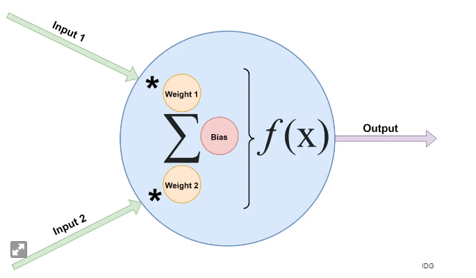

# neuralNetwork
Trabalho de Inteligência artificial. 

## Redes Neurais
  Uma rede neural, também conhecida como rede neural artificial (RNA) ou perceptron multicamadas, é um modelo computacional inspirado na estrutura e funcionamento do cérebro humano. Ela é uma parte fundamental da área de aprendizado de máquina e inteligência artificial. Uma rede neural é composta por unidades de processamento chamadas neurônios artificiais interconectados em camadas.

